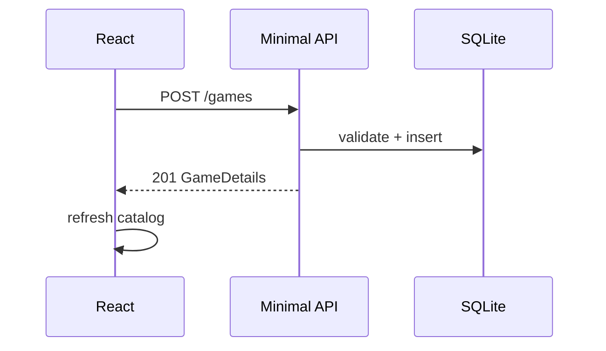

# GameStore

> Full-stack games catalog. .NET 10 minimal API + React frontend.


---

## Flow



---

## API

| Method | Route          | Body            | Returns          |
| ------ | -------------- | --------------- | ---------------- |
| GET    | `/games`       | —               | `GameSummary[]`  |
| GET    | `/games/{id}`  | —               | `GameDetails`    |
| POST   | `/games`       | `CreateGameDto` | `201`            |
| PUT    | `/games/{id}`  | `UpdateGameDto` | `204`            |
| DELETE | `/games/{id}`  | —               | `204`            |
| GET    | `/genres`      | —               | `GenreDto[]`     |

---

## Backend Highlights

| Pattern              | Why                          |
| -------------------- | ---------------------------- |
| Minimal API groups   | Clear, terse routing         |
| DTO boundary         | Entities never leak          |
| `AsNoTracking`       | Lean read queries            |
| Migrations + seeding | Deterministic startup        |
| Scoped CORS          | Locked to dev origins        |
| Validation pipeline  | Fail fast at the edge        |

---

## Structure

```
GameStore.Api/        .NET 10 minimal API
  EndPoints/          route groups
  Models/             EF entities
  DTOs/               request/response
  Data/               DbContext, migrations, seed

GameStore.Frontend/   React + Vite
  src/api/            fetch client
  src/components/     catalog, table, form, details
```

---

## Run

```bash
dotnet run --project GameStore.Api

cd GameStore.Frontend && npm i && npm run dev
```

DB auto-migrates and seeds on first run.

---

## AI Disclosure

Backend by me. Frontend UI generated with AI assistance and integrated by me against the API contracts I designed.

---

**Yohai Dejorno** · [@yohaidajurno](https://github.com/yohaidajurno)
